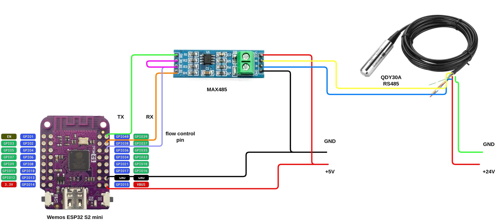
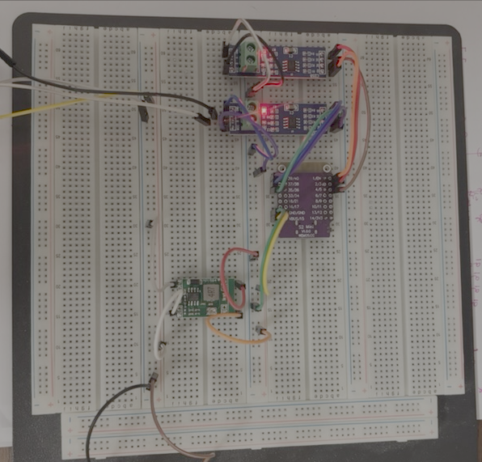
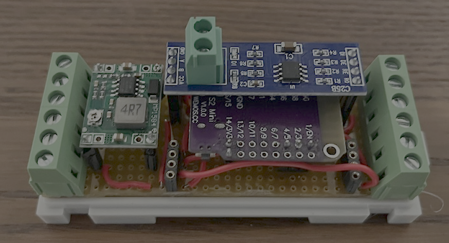
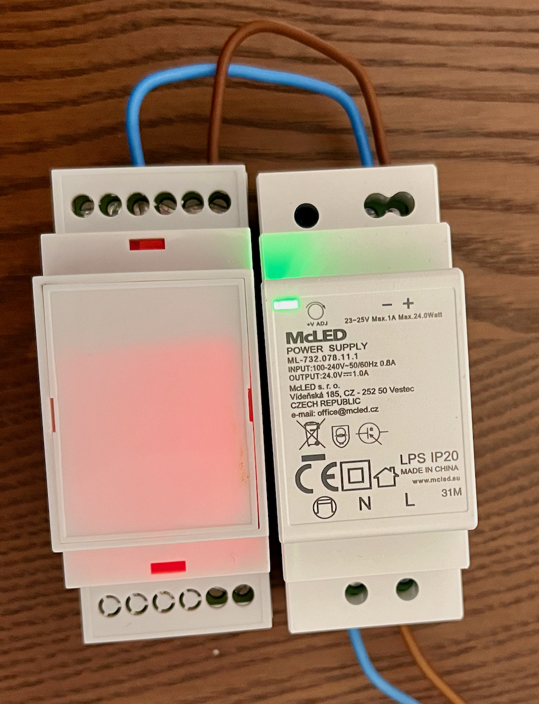
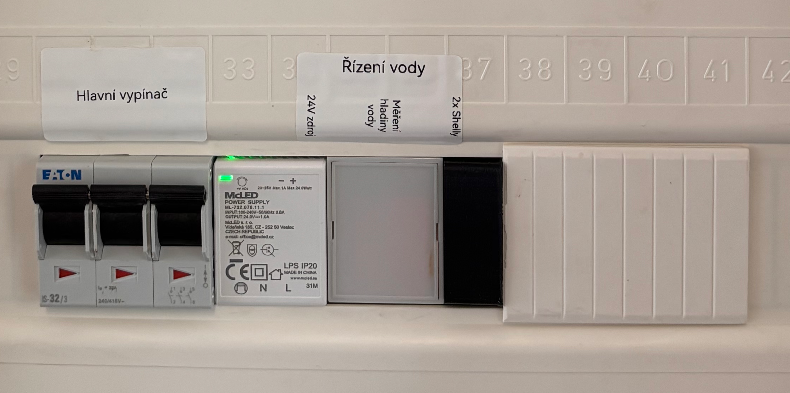
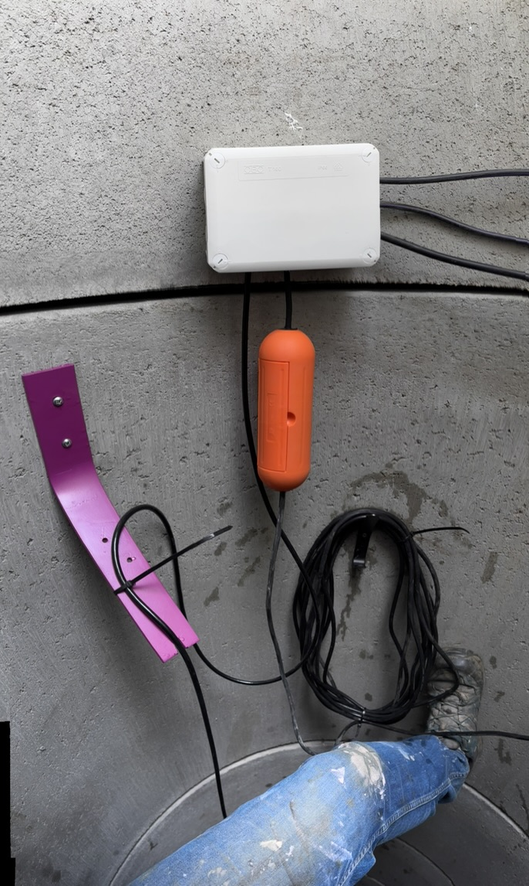
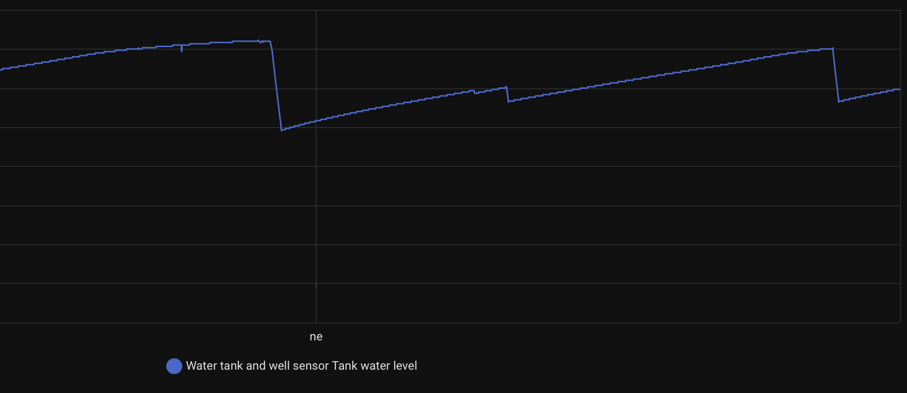

# Smart Water Management System (DIY)

This project details the construction of a smart water management system, designed to provide comprehensive control and monitoring of water resources. The design, code, and documentation are shared with the intent of assisting others in building similar systems for their own needs.

The target device is intended for DIN rail mounting, occupying no more than three standard positions (including the power supply). Key design goals are reliability and minimal maintenance. Integration with Home Assistant is a priority, enabling centralized monitoring and control of water levels and pump activation.

The primary application is for managing water used in lawn irrigation. The system monitors a 16m³ underground concrete rain water tank and a well, with a focus on preventing groundwater infiltration into an adjacent cellar. The goal is to proactively manage water levels to avoid water intrusion through the concrete structure.

## Off-the-Shelf Solutions

An initial effort was made to identify readily available commercial solutions to minimize development time. The following options were evaluated but ultimately rejected due to lack of Home Assistant integration:

 - [Lovato - LVM40A127](https://catalogue.lovatoelectric.com/cz_cs/Hladinova-rele-Modularni-verze-Jednonapetova-rele-Multifunkcni-Automaticky-reset-Napajeci-napeti-110-127VAC/LVM40A127/snp)
    - Functionally suitable, but lacks Home Assistant support.
 - [Elko - HRH-6](https://www.elkoep.cz/hladinovy-spinac---hrh-6)
    - Meets functional requirements, but lacks Home Assistant support.

## Solution

Home Assistant integration is a key requirement for this project, enabling detailed monitoring of water consumption and sources (groundwater, rainwater). To achieve this, [ESPhome](https://esphome.io) was selected as the primary software platform due to its excellent native support for Home Assistant.

For water level sensing, [RS-485 water level transmitters](https://www.aliexpress.com/item/1005006071143565.html?spm=a2g0o.order_list.order_list_main.15.21251802wY54lU) were chosen based on recommendations from various DIY forums. This RS-485 version requires a DC 24V power supply.

The ESP32 board and RS-485 converters are powered by 5V, necessitating the use of a [DC/DC 24V to 5V step-down converter](https://dratek.cz/arduino/1738-step-down-modul-napajeni-mini-buck-nastavitelny.html).

Since ESP boards typically lack an RS-485 interface, a [MAX485 converter](https://www.aliexpress.com/item/1005006071143565.html?spm=a2g0o.order_list.order_list_main.15.21251802wY54lU) was incorporated to facilitate communication.

The [Wemos S2 mini](https://www.wemos.cc/en/latest/s2/s2_mini.html) ESP32 board was selected as the microcontroller platform.

A [SZOMK DIN rail enclosure](https://www.aliexpress.com/item/1005006067012648.html?spm=a2g0o.order_list.order_list_main.25.21251802wY54lU) was chosen for mounting the device.

All components were assembled using a universal [welding board](https://www.aliexpress.com/item/1005008742636890.html?spm=a2g0o.productlist.main.1.34afH1ZaH1Zaqy&algo_pvid=55c46ca8-10a7-4726-8021-b2f2c0332c86&algo_exp_id=55c46ca8-10a7-4726-8021-b2f2c0332c86-0&pdp_ext_f=%7B%22order%22%3A%22-1%22%2C%22eval%22%3A%221%22%7D&pdp_npi=4%40dis%21USD%2134.19%2117.09%21%21%21244.23%21122.11%21%402103834817483773896252107eef65%2112000046482577473%21sea%21CZ%21808039854%21X&curPageLogUid=V1PRVwEGC3yA&utparam-url=scene%3Asearch%7Cquery_from%3A) and standard soldering techniques.

The wiring diagram:

 
 


Prototype:


Software configuration of ESP board is in [`wemos.yml`](wemos.yml) file, and is installed to the ESP board followingly:

```shell
esphome run --device /dev/tty.usbmodem01  wemos.yml
```

The final deployment happened in two locations 1) Wiring cabinet and 2) Well itself.





Power to the water pump is controlled via [Shelly 1PM gen4](https://kb.shelly.cloud/knowledge-base/shelly-1pm-gen4) from HomeAssistant automation.

```yaml
alias: Reduce level in the well
description: ""
triggers:
  - type: value
    device_id: 08b8908df6bd0a1333463f036524b8cf
    entity_id: f78c7891c7121e14087a909f3dc3ac79
    domain: sensor
    trigger: device
    above: 190
conditions: []
actions:
  - type: turn_on
    device_id: e4e89b6e64a19824696108074a7f5344
    entity_id: eb95d37d9cd09c7107dc2bb41d6ec6e7
    domain: switch
  - wait_for_trigger:
      - type: value
        device_id: 08b8908df6bd0a1333463f036524b8cf
        entity_id: f78c7891c7121e14087a909f3dc3ac79
        domain: sensor
        trigger: device
        below: 140
  - type: turn_off
    device_id: e4e89b6e64a19824696108074a7f5344
    entity_id: eb95d37d9cd09c7107dc2bb41d6ec6e7
    domain: switch
mode: single
```


**Main components used:**
- [Wemos S2 mini](https://www.wemos.cc/en/latest/s2/s2_mini.html) ESP32 board
- [RS-485 water level transmitter](https://www.aliexpress.com/item/1005006071143565.html?spm=a2g0o.order_list.order_list_main.15.21251802wY54lU) (24V DC)
- [MAX485 RS-485 converter](https://www.aliexpress.com/item/1005006071143565.html?spm=a2g0o.order_list.order_list_main.15.21251802wY54lU)
- [DC/DC 24V to 5V step-down converter](https://dratek.cz/arduino/1738-step-down-modul-napajeni-mini-buck-nastavitelny.html)
- [SZOMK DIN rail enclosure](https://www.aliexpress.com/item/1005006067012648.html?spm=a2g0o.order_list.order_list_main.25.21251802wY54lU)
- [Universal soldering/welding board](https://www.aliexpress.com/item/1005008742636890.html?spm=a2g0o.productlist.main.1.34afH1ZaH1Zaqy&algo_pvid=55c46ca8-10a7-4726-8021-b2f2c0332c86&algo_exp_id=55c46ca8-10a7-4726-8021-b2f2c0332c86-0&pdp_ext_f=%7B%22order%22%3A%22-1%22%2C%22eval%22%3A%221%22%7D&pdp_npi=4%40dis%21USD%2134.19%2117.09%21%21%21244.23%21122.11%21%402103834817483773896252107eef65%2112000046482577473%21sea%21CZ%21808039854%21X&curPageLogUid=V1PRVwEGC3yA&utparam-url=scene%3Asearch%7Cquery_from%3A)

## Experience
- The water level sensor is very accurate!
- The whole setup (2x RS-485 convertor, 1x water level sensor) comsumed 1W with every 5s reading.



## Challenges

During assembly, the ESP board failed to connect to Wi-Fi unless one of the RS-485 converters was removed, so only one water level sensor was deployed.

Further updates to this project will be provided.

## Future work

My next steps will be:
- Measuring device will accommodate only one position in wiring closet
- Two measuring locations supported
- Upgrade to [ESP32-S3-Zero](https://www.waveshare.com/wiki/ESP32-S3-Zero) that should lower consumption and reduce space necessary in the box

Future features:
- This measuring device can control Shelly directly without the need of Home Assistant.
- General goal is to configure the measuring device from Home Assistant such that I only specify water levels, and the device drives motors directly even without Home Assistant's automation.
- Home Assistant blueprint for device configuration

# References
1. https://community.home-assistant.io/t/water-level-sensor-qdy30a-modbus-rs485-with-esp32-s2-mini/698712